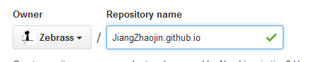

* content
{:toc}

## 选择jekyll的原因

1.github提供了免费的空间可用于搭建博客，而且内置了jekyll解析器
2.jekyll并不复杂，可以阅读中文文档或者博客模板来掌握它
3.传送门：[jekyll中文官网网站](http://jekyllcn.com/) || [jekyll博客模板]（http://jekyllthemes.org/）
> 当时找了很多模板，都不是很满意（逼格太高啦····简洁成白纸了卧槽····老外写的好抽象orz····），所以如果有能力当然自己写一个最好啦！
> 嗯····所以如果你中意我····做的的博客话，欢迎来fork。仓库再此：[别说话····](https://github.com/Zebrass/Zebrass.github.io)
---

## 使用jekyll搭建博客

---

#### 你需要做的准备

（自行谷歌或者某度哦）
1. 创建你的github账号
2. 了解Git的基本原理，参考教程：[点我](https://git-scm.com/book/zh/v2/%E8%B5%B7%E6%AD%A5-%E5%85%B3%E4%BA%8E%E7%89%88%E6%9C%AC%E6%8E%A7%E5%88%B6)
3. 安装Git
4. 编辑器推荐sublime或者webstorn
5. 寻找一个jekyll博客模板：上面有主题网站

#### 制定博客

fork你找到的博客模板，下载到本地，用编辑器完成修改。

#### 创建仓库

在github上创建远程仓库，仓库名为：你的github名称.github.io

在本地创建一个文件夹命名为：你的github名称.github.io

将修改好的文件复制到刚刚创建的文件夹,文件结构文档里说的挺清楚了，我的文档结构：

#### 推送到github

打开Git Bash，假设我的本地文件夹是 D：你的github名称.github.io 则输入代码如下

        <---进入blog文件夹--->
        cd D：你的github名称.github.io
        <---初始化仓库--->
        git init
        <---添加全部文件到暂存区--->
        git add .
        <---提交改动到本地仓库--->
        git commit -m "first"
        <---将远程仓库在本地添加一个引用：origin--->
        git remote add origin https://github.com/你的github名称/你的github名称.github.io.git
        <---推送到远程仓库--->
        git push origin master

等待小许，显示推送完成后一般都可以立即访问的：https://你的github名称.github.io

---

## 辅助工具

---

#### 写博客

如今写文章当然用markdown啦，参考教程：[markdown](http://www.appinn.com/markdown/)

#### 图床

我用了七牛，体验用户的存储空间免费额度是1G、标准用户的存储空间免费额度是10G，对我们足够啦：[biubiubiu](http://www.qiniu.com/)

#### 绑定域名

拥有自己的域名才显得<del>装逼</del>高！大！上！嘛····于是博主决定去[godaddy](http://www.godaddy.com/)买一个，得知[腾讯云]给学生发优惠券的,遂免费领取了一个。
然而····好吧我买了.cn后缀的····要有很麻烦的备案才能用···所以咋还是破点小钱拥抱.com吧。
绑定的过程很简单，这篇百度经验告诉了你。[github博客绑定域名](http://jingyan.baidu.com/article/36d6ed1f5356f31bcf488314.html)

---

## 注意事项

*  前端发展速度太快，许多好教程到现在容易变成坑，建议多找些时间较近的教程看。
*  jekyll中的css是用sass写的，也可以直接用css写没问题的。[sass英文文档](http://sass-lang.com/documentation/file.SASS_REFERENCE.html) || [sass中文入门](http://www.w3cplus.com/sassguide/)
*  博客默认是没有评论系统的，本文的评论系统使用了多说，详细安装办法可访问[多说官网](http://duoshuo.com/)。

---
##### 第一篇博文，没啥干货=.= 算是对自己建立博客过程的一个记录或者留念吧，谨作为一条道路的开始······
